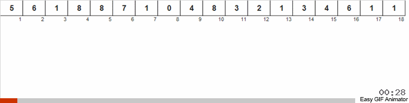

# Counting sort

---

Главная идея алгоритма — посчитать, сколько раз встречается каждый элемент в массиве, а потом заполнить исходный массив результатами этого подсчёта. Для этого нам нужен вспомогательный массив, где мы будем хранить результаты подсчёта. Даже если нам надо отсортировать миллион чисел, мы всё равно знаем диапазон этих чисел заранее, например, от 1 до 100. Это значит, что во вспомогательном массиве будет не миллион элементов, а сто.

В общем виде всё работает так:

1. Мы создаём вспомогательный массив и на старте заполняем его нулями. 
2. Проходим по всему исходному массиву и смотрим очередное значение в ячейке. 
3. Берём содержимое этой ячейки и увеличиваем на единицу значение вспомогательного массива под этим номером. Например, если мы встретили число 5, то увеличиваем на единицу пятый элемент вспомогательного массива. Если встретили 13 — тринадцатый. 
4. После цикла во вспомогательном массиве у нас хранятся данные, сколько раз встречается каждый элемент. 
5. Теперь мы проходим по вспомогательному массиву, и если в очередной ячейке лежит что-то больше нуля, то мы в исходный массив столько же раз отправляем номер этой ячейки. Например, в первой ячейке вспомогательного массива лежит число 7. Это значит, что в исходный массив мы отправляем единицу 7 раз подряд.
--- 

