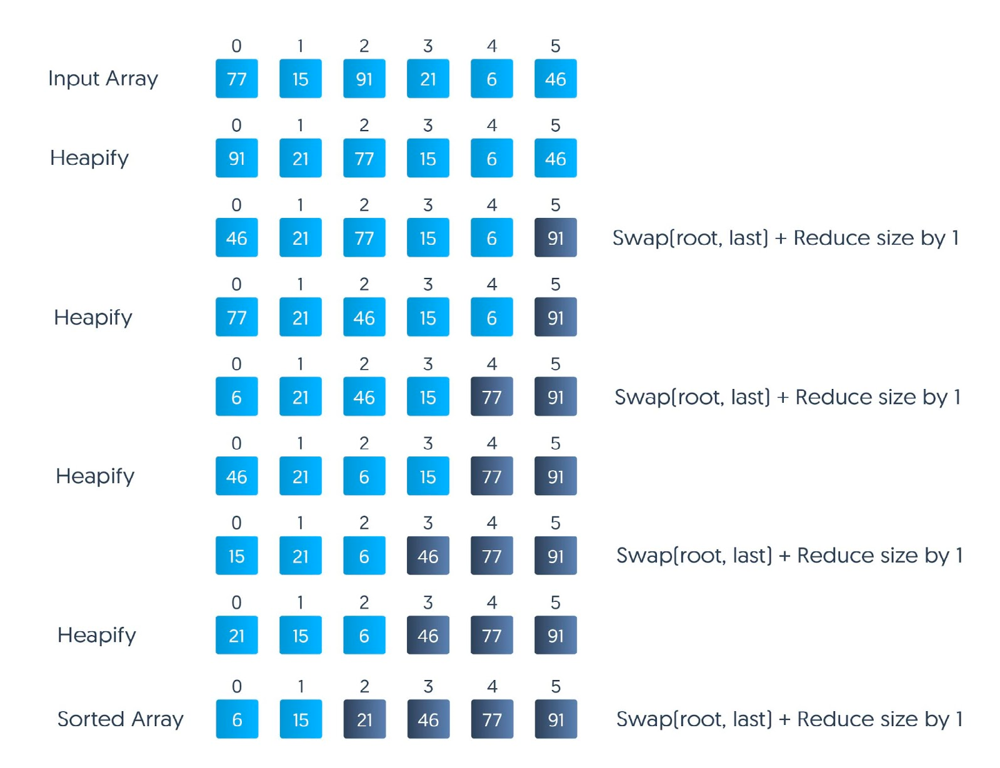

# Heap sort

---

Алгоритм пирамидальной сортировки в порядке по возрастанию:

1. Постройте max-heap из входных данных.
2. На данном этапе самый большой элемент хранится в корне кучи. Замените его на последний элемент кучи, а затем уменьшите ее размер на 1. Наконец, преобразуйте полученное дерево в max-heap с новым корнем.
3. Повторяйте вышеуказанные шаги, пока размер кучи больше 1.

**max-heap** - это законченное двоичное дерево, в котором элементы хранятся в особом порядке: значение в родительском узле больше значений в его двух дочерних узлах. 

