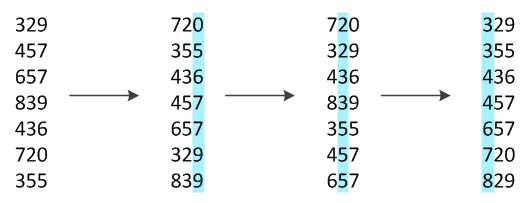

# Radix sort

---

Алгоритм поразрядной сортировки гениален в том, что сортирует не числа целиком, а значения разрядов. Получается, что он
как бы разбирается с числами на уровне единиц, десятков, сотен и т. д. и только потом он делает общую сортировку. Это
позволяет ему не бегать по всем сравниваемым числам и не делать миллион сравнений. Отсюда и экономия времени.

